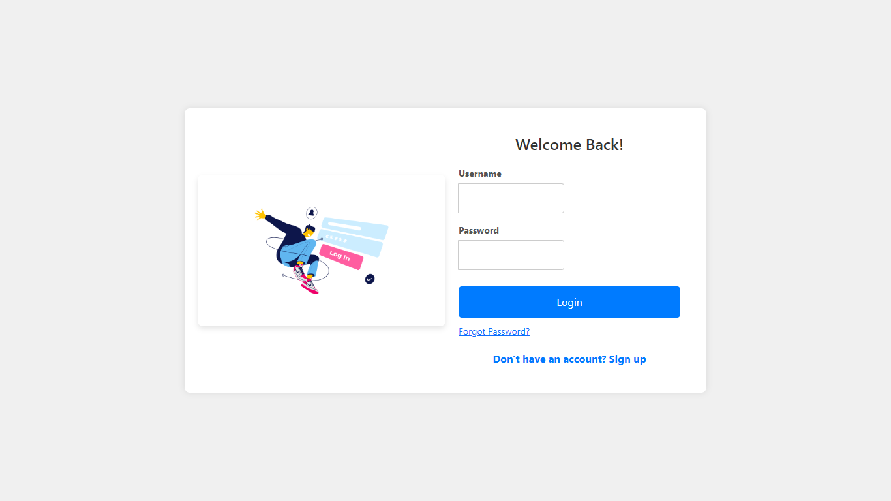

<div align="center">
  
  <h1>Expense Management System</h1>
</div>

<div align="center">
  <a href="https://expense-management-app1.netlify.app/">
    
  </a>
  <a href="https://github.com/your-username/expense-management-system/blob/main/LICENSE">
    
  </a>
  <a href="https://github.com/your-username/expense-management-system/stargazers">
    
  </a>
  <a href="https://github.com/your-username/expense-management-system/issues">
    
  </a>
</div>

## 📋 Table of Contents
- [About the Project](#about-the-project)
- [Features](#features)
- [Screenshots](#screenshots)
- [Technologies Used](#technologies-used)
- [Installation and Setup](#installation-and-setup)
- [Contributing](#contributing)
- [License](#license)

## 💡 About the Project
The **Expense Management System** is a comprehensive web application that helps users and administrators manage their expenses and incomes efficiently. Built using React.js for the frontend, Spring Boot for the backend, and MySQL as the database, it provides a seamless experience for financial management.

## ✨ Features
The Expense Management System offers the following features:

- **🔒 User Authentication**: Users can sign up, log in, and log out of the system.
- **📊 Dashboard**: Users and administrators can view their expenses, incomes, and overall financial status on their respective dashboards.
- **💸 Expense Management**: Users can add, edit, and view their expenses.
- **💰 Income Management**: Users can add, edit, and view their incomes.
- **📂 Bulk Import**: Administrators can import expenses and incomes in bulk using a CSV file.
- **👥 User Management**: Administrators can view, edit, and manage user accounts.
- **📑 Reporting**: Administrators can generate detailed reports on expenses, incomes, and user activities.

## 📷 Screenshots
Here are the screenshots of the various pages in the Expense Management System:

1. **Admin Dashboard Page**:
   

2. **Bulk Import Page**:
   

3. **Edit User Profile Page**:
   

4. **Expense Add Page**:
   

5. **Expense List Page**:
   

6. **Income Add Page**:
   

7. **Login Page**:
   

8. **Main Page**:
   

9. **Admin Reports Page**:
   

10. **Signup Page**:
    

11. **User Dashboard Page**:
    

12. **User Expense List Page**:
    

13. **User Income List Page**:
    

14. **User List Page**:
    

15. **User Expense List Page (Admin)**:
    

16. **User Profile Page**:
    

17. **User Reports Page**:
    

## 🛠 Technologies Used
The Expense Management System is built using the following technologies:

- **Frontend**:
    - 
    - 
    - 
- **Backend**:
    - 
    - 
    - 
- **Database**:
    - 

## ⚙️ Installation and Setup
To set up the Expense Management System, follow these steps:

1. **Clone the repository:**
   ```bash
   git clone https://github.com/your-username/expense-management-system.git
2. **Set up the backend (Spring Boot):**
- Install Java and Maven.
- Update the application.properties file with your MySQL database credentials.
- Run the Spring Boot application.
- Set up the frontend (React.js):
- Install Node.js and npm.
- Navigate to the frontend directory and run npm install to install the dependencies.
- Run npm start to start the development server.
- Once the setup is complete, you can access the Expense Management System at http://localhost:3000.

## 🤝 Contributing
- If you'd like to contribute to the Expense Management System, please follow these guidelines:

- Fork the repository.
 - Create a new branch for your feature or bug fix.
- Make your changes and commit them.
- Push your changes to your forked repository.
- Create a pull request to the main repository.

## 📜 License
The Expense Management System is licensed under the MIT License.
